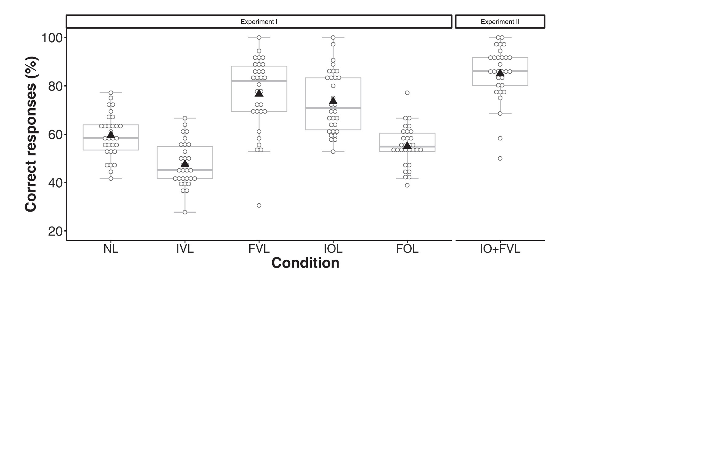
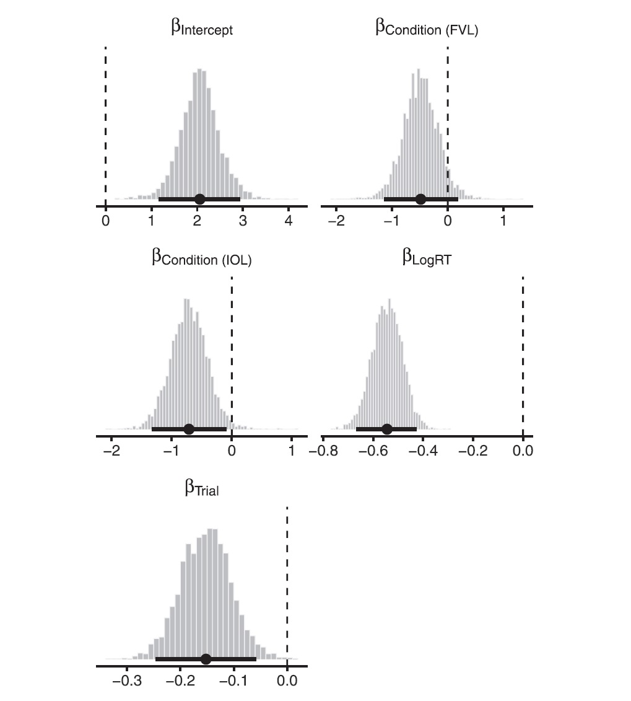

Description of the original paper

The original paper aims to test the effects of vowel and onset consonant lengthening on segmentation; namely, listeners’ ability to use vowel lengthening and onset consonant lengthening in human conversation as cues to word-finality and word-initiality. The original paper used experiment I (N = 150) with five conditions and experiment II (N = 30) with one condition to examine the effects through Bayesian analysis methods. The two experiments' results supported the prediction that both word-final vowel lengthening and word-initial onset consonant lengthening improves the listeners’ segmentation.

Definitions of variable names

In experiment I, five conditions were used to test participant accuracy rates including no lengthening (NL), final vowel lengthening (FVL), initial onset consonant lengthening (IOL), initial vowel lengthening (IVL), and final onset consonant lengthening (FOL) (p.1869). In experiment II, one condition was used to test participant accuracy rates: initial onset consonant plus final vowel lengthening (IOþFVL) (p. 1872).

The reanalysis outline

In this replication assignment, I used both data from two experiments of the original paper. I replicated (1) a descriptive analysis of the demographics of two experiment participants (sex, mean age, SD, and range), (2) two visualizations including the accuracy rates of responses and the marginal posterior distributions of the fixed effect parameters in experiment II, and (3) an inferential analysis of experiment II using a Bayesian mixed-effects logistic regression model.


```{r setup, include=FALSE}
knitr::opts_chunk$set(echo = TRUE)
```

# Load non-base packages
```{r}
library(readxl)
library(lme4)
library(tidyverse)
library(performance)
library(lmerTest)
library(optimx)
library(parallel)
library(brms)
library(bayesplot)
library(tidybayes)
library(mcmcplots)
library(dplyr)
```

# Load data from two experiments of the orignial paper
```{r}
data1 <- read_excel("Exp_1_Data.xlsx")
head(data1)

data2 <- read_excel("Exp_2_Data.xlsx")
head(data2)
```

# Combine the dataframes
```{r}
data <- rbind(data1, data2)

# No. of observations
nrow(data) # 6480
# No. of subjects
nrow(data) / 36
```

# Descriptive analysis (sex, mean age, SD, and range)
## Experiment I
```{r}
# Exp 1: Select subjects of TP-only, initial onset lengthening, initial vowel lengthening, final onset lengthening, and final vowel lengthening
data_exp1 <- data[data$Condition %in% c("TP-only", "Initial_onset_lengthening", "Initial_vowel_lengthening","Final_onset_lengthening", "Final_vowel_lengthening"),]

# No. of observations
nrow(data_exp1) # 5400
# No. of subjects
nrow(data_exp1) / 36
```

## Expriment I data summary
```{r}
# Count male and female subjects
ExpSubs_exp1 <- aggregate(Answer.ACC~Subject+Condition+Sex, data_exp1, mean)
xtabs(~Sex, ExpSubs_exp1)
# 60 males; 90 females

# Count no. of subjects in each condition
xtabs(~Condition, ExpSubs_exp1)
# 30 in each condition

# Mean age, SD, and range
mean(aggregate(Answer.ACC~Subject+Condition+Age, data_exp1, mean)$Age)
sd(aggregate(Answer.ACC~Subject+Condition+Age, data_exp1, mean)$Age)
min(aggregate(Answer.ACC~Subject+Condition+Age, data_exp1, mean)$Age)
max(aggregate(Answer.ACC~Subject+Condition+Age, data_exp1, mean)$Age)
```

## Experiment II
```{r}
# Exp 2: Select subjects of initial onset lengthening, final vowel lengthening, and IO+FV lengthening conditions
data_exp2 <- data[data$Condition %in% c("Initial_onset_lengthening",
                                       "Final_vowel_lengthening", "IO_FV_lengthening"),]

# No. of observations
nrow(data_exp2) # 3240

# No. of subjects
nrow(data_exp2) / 36 # 90
```

## Expriment II data summary
```{r}
# Count male and female subjects (select the "IO + FV lengthening" condition only)
ExpSubs_exp2 <- aggregate(Answer.ACC ~ Subject + Condition + Sex,
                         data_exp2[data_exp2$Condition == "IO_FV_lengthening",], mean)
xtabs(~Sex, ExpSubs_exp2)
# 16 males; 14 females

# Mean age, SD, and range
mean(aggregate(Answer.ACC~Subject+Condition+Age, data_exp2, mean)$Age)
sd(aggregate(Answer.ACC~Subject+Condition+Age, data_exp2, mean)$Age)
min(aggregate(Answer.ACC~Subject+Condition+Age, data_exp2, mean)$Age)
max(aggregate(Answer.ACC~Subject+Condition+Age, data_exp2, mean)$Age)
```

## Replicate Figure 2 in the priginal paper (my visulazation one) 
# Calculate accuracy rates in both two experiments
```{r}
data_exps_1_2 <- rbind(data_exp1, data_exp2[data_exp2$Condition == "IO_FV_lengthening",]) %>%
  select(Subject, Answer.ACC, Condition) %>%
  group_by(Condition) %>%
  mutate(Condition_mean = mean(Answer.ACC)) %>%
  ungroup() %>%
  group_by(Subject) %>%
  mutate(Accuracy = mean(Answer.ACC)) %>%
  ungroup() %>%
  select(-Answer.ACC) %>%
  distinct() %>%
  mutate(Condition_mean_per = Condition_mean * 100, Accuracy_per = Accuracy * 100)
```

# Combie experiment I and II conditions all together
```{r}
# Add an Experiment factor to differentiate the conditions between experiment I and experiment II
data_exps_1_2$Experiment <- ifelse(data_exps_1_2$Condition == "IO_FV_lengthening",
                                   "Experiment II", "Experiment I")

# Recode Condition as Condition_new and order its levels (because Figure 2 in the original paper only indicate each condition's initiate)
data_exps_1_2 <- data_exps_1_2 %>%
  mutate(Condition_new = recode(Condition,
                                "TP-only" = "NL",
                                "Initial_vowel_lengthening" = "IVL",
                                "Final_vowel_lengthening" = "FVL",
                                "Initial_onset_lengthening" = "IOL",
                                "Final_onset_lengthening" = "FOL",
                                "IO_FV_lengthening" = "IO+FVL")) %>%
  mutate(Condition_new = factor(Condition_new,
                                levels = c("NL", "IVL", "FVL", "IOL", "FOL", "IO+FVL")))

# Using boxplot to replicate the visualization of Figure 2
Fig2_replication <- ggplot(data_exps_1_2,
                    aes(x = Condition_new, y = Accuracy_per)) +
  stat_boxplot(geom = "errorbar", width = 0.3, color = "darkgrey") +
  geom_boxplot(color = "darkgrey") +
  geom_dotplot(binaxis = "y", stackdir = "center", 
               binwidth = 1.6, color = "#696969", fill = "white") +
  stat_summary(fun.y = mean, geom = "point", shape = 17, size = 4, color = "black", fill = "black") +
  ylim(c(20,100)) +
  theme_classic() +
  xlab("Condition") +
  ylab("Correct responses (%)") +
  theme(axis.text.x = element_text(size = 16),
        axis.text.y = element_text(size = 18),
        axis.title.x = element_text(size = 20, face = "bold"),
        axis.title.y = element_text(size = 20, face = "bold")) +
  facet_grid(~ Experiment, scales = "free", space = "free")
Fig2_replication
```

## Embed the image of Figure 2 in the original paper to compare the replication 
```{r echo=FALSE, out.width="200%"}

```

# Inferential analysis of experiment II
## Expriment II data preprocessing
```{r}
## Transform Trial in data_exp2
data_exp2$Trial <- (data_exp2$Block - 2)*12 + data_exp2$Trial

## Check no. of trials in which no responses were made
length(which(is.na(data_exp2$Answer.RESP)))
# 23

## Exclude trials with no responses
nrow(data_exp2)
data_exp2 <- na.omit(data_exp2)
nrow(data_exp2)

## Omission rate:
((3240 - 3223) / 3240) * 100

## Exclude trials with time-outs
nrow(data_exp2[data_exp2$Answer.RT <= 0,])
data_exp2 <- data_exp2[data_exp2$Answer.RT > 0,]
nrow(data_exp2)

## Assign contrast and transform time-outs
data_exp2$Condition <- as.factor(data_exp2$Condition)
levels(data_exp2$Condition)
contrasts(data_exp2$Condition)
contrasts(data_exp2$Condition) <- cbind(c(1,0,0), c(0,1,0))
contrasts(data_exp2$Condition) ## IO+FVL as the baseline

## Transform time-outs
data_exp2$Answer.RT <- log(data_exp2$Answer.RT)

## Center time-outs and Trial
data_exp2$Answer.RT <- scale(data_exp2$Answer.RT)
data_exp2$Trial <- scale(data_exp2$Trial)

aggregate(Answer.ACC ~ Condition, data_exp2, mean)
```

## Set priors for Bayesian analysis
```{r}
priors <- c(
  set_prior("normal(0,10)", class = "Intercept"),
  set_prior("normal(0,10)", class = "b"),
  set_prior("normal(0,10)", class = "sd"),
  set_prior("lkj(2)", class = "cor")
  )
```

## Run glmer in Experiment II (Bayesian)
```{r eval = FALSE}
## Run analysis
bmix2 <- brm(Answer.ACC ~ Condition + Answer.RT + Trial +
               (1|Subject) + (1 + Condition|Word) + (1|Partword),
             data = data_exp2,
             family = 'bernoulli',
             warmup = 1000,
             chains = 4,
             iter = 2000,
             prior = priors,
             sample_prior = TRUE,
             seed = 2021,
             control = list(adapt_delta = 0.99, max_treedepth = 15))
```

## Save the above results
```{r}
##save.image("all_objects.RData") 
load("all_objects.RData")
```

## Get results from the Bayesian regression model
```{r}
summary(bmix2)
```

# Replicate Fihure 4 in the original paper (my visualization two)
```{r}
## Get posterior distributions
post_exp2 <- as.data.frame(bmix2)
```

## Keep only posterior distributions of fixed-effect parameters and rename columns
```{r}
post_fixed_exp2 <- post_exp2 %>%
  select(starts_with("b")) %>%
  rename(b_Condition_FVL = b_Condition1,
         b_Condition_IOL = b_Condition2,
         b_LogRT = b_Answer.RT)
```

## Compute accuracy (%) for each condition and accuracy difference of IOL and FVL from the combined cue condition
```{r}
post_fixed_exp2 <- post_fixed_exp2 %>%
  mutate(IO_FV_acc = plogis(b_Intercept) * 100,
         FVL_acc = plogis(b_Intercept + b_Condition_FVL) * 100,
         IOL_acc = plogis(b_Intercept + b_Condition_IOL) * 100,
         Combined_vs_FVL_diff = IO_FV_acc - FVL_acc,
         Combined_vs_IOL_diff = IO_FV_acc - IOL_acc)
```

## Get marginal posteriors of fixed-effect parameters
```{r}
par(mfrow = c(3, 2))
color_scheme_set("gray")
post_fixed_exp2 <- post_fixed_exp2 %>%
  select(b_Intercept:b_Trial) %>%
  gather(Parameter, Value, b_Intercept:b_Trial) %>%
  mutate(Parameter = factor(Parameter, levels = c("b_Intercept",
                                                   "b_Condition_FVL",
                                                   "b_Condition_IOL",
                                                   "b_LogRT",
                                                   "b_Trial"))) %>%
  mutate(Parameter = plyr::revalue(Parameter,
                             c("b_Intercept" = expression(beta["Intercept"]),
                               "b_Condition_FVL" = expression(beta["Condition (FVL)"]),
                               "b_Condition_IOL" = expression(beta["Condition (IOL)"]),
                               "b_LogRT" = expression(beta["LogRT"]),
                               "b_Trial" = expression(beta["Trial"])
                             ))) %>%
  ggplot(aes(x = Value, y = 0)) +
  stat_histintervalh(point_interval = mean_qi,
                     .width = .95, fill = "grey67",
                     slab_color = "grey92", breaks = 50,
                     slab_size = .2,
                     outline_bars = T,
                     normalize = "panels") +
  theme_classic() +
  geom_vline(xintercept = 0, linetype = "dashed", color = "black") +
  xlab("") +
  ylab("") +
  theme(axis.title.x = element_text(size = 12),
        axis.text.y = element_blank(),
        axis.ticks.y = element_blank(),
        axis.line.y = element_blank(),
        strip.text = element_text(size = 11),
        strip.background = element_blank()) + 
  facet_wrap(. ~ Parameter, scales = "free", ncol = 2,
             labeller = label_parsed)

post_fixed_exp2 
```
## Embed the image of Figure 4 in the original paper to compare the replication
```{r echo=FALSE, out.width="200%"}

```

Discussion and reflection

The replication results are pretty successful: (1) the descriptive analysis of the demographics of two experiment participants are the same as the original paper, (2) two visualizations including the accuracy rates of responses and the marginal posterior distributions of the fixed effect parameters in experiment II are closely similar to the original ones, and (3) the replication and the original inferential analysis of experiment II using a Bayesian mixed-effects logistic regression model are also alike.

While the data I obtained from the original datasets are quite complete, the whole process of doing this replication work was full of challenges. First, the data visualization was nearly impossible to replicate completely the same presentation without the authors’ description of the size, color, themes, and other details. I had to repeatedly try different functions and discuss with my peers to speculate the possible style. Second, running a Bayesian analysis requires not only coding knowledge but also needs enough computer capacity. I have spent hours sorting out my Windows system's compatibility problems of running the code by searching across different R-related forums. It turned out that many Windows system users have experienced similar program compilation issues. I had to use a Mac laptop to run the analysis instead.         

While the replication has similar results to the original ones, there are still some slight differences because of the limited data processing description. Luckily, some important steps are addressed in the original paper, including the packages and functions used as well as the data exclusion process. For example, I followed closely the author’s data preprocessing steps: “responses in the test phase were analyzed and
time-outs (0.6% of all data of experiment II) were discarded (p.1872).” Also, I read through the article to follow nearly the same steps as the author did, such as setting the same prior applied to the fixed-effect parameters (e.g., p. 1871). Of course, there is still a possibility of inconsistency caused by the seed and iter setting in the model, leading to unsatisfactory replication results.

